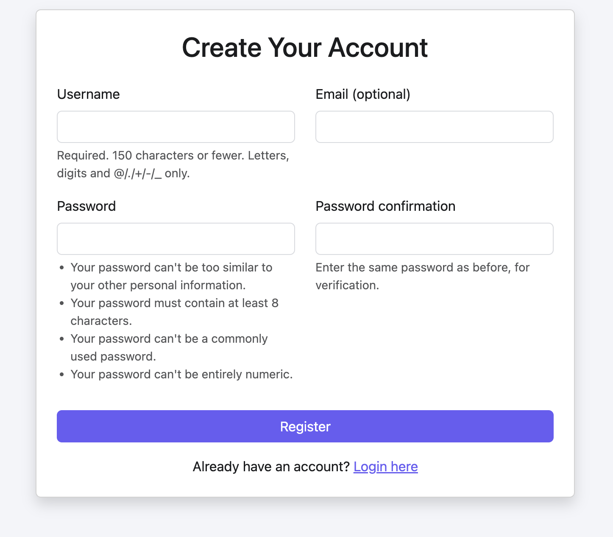
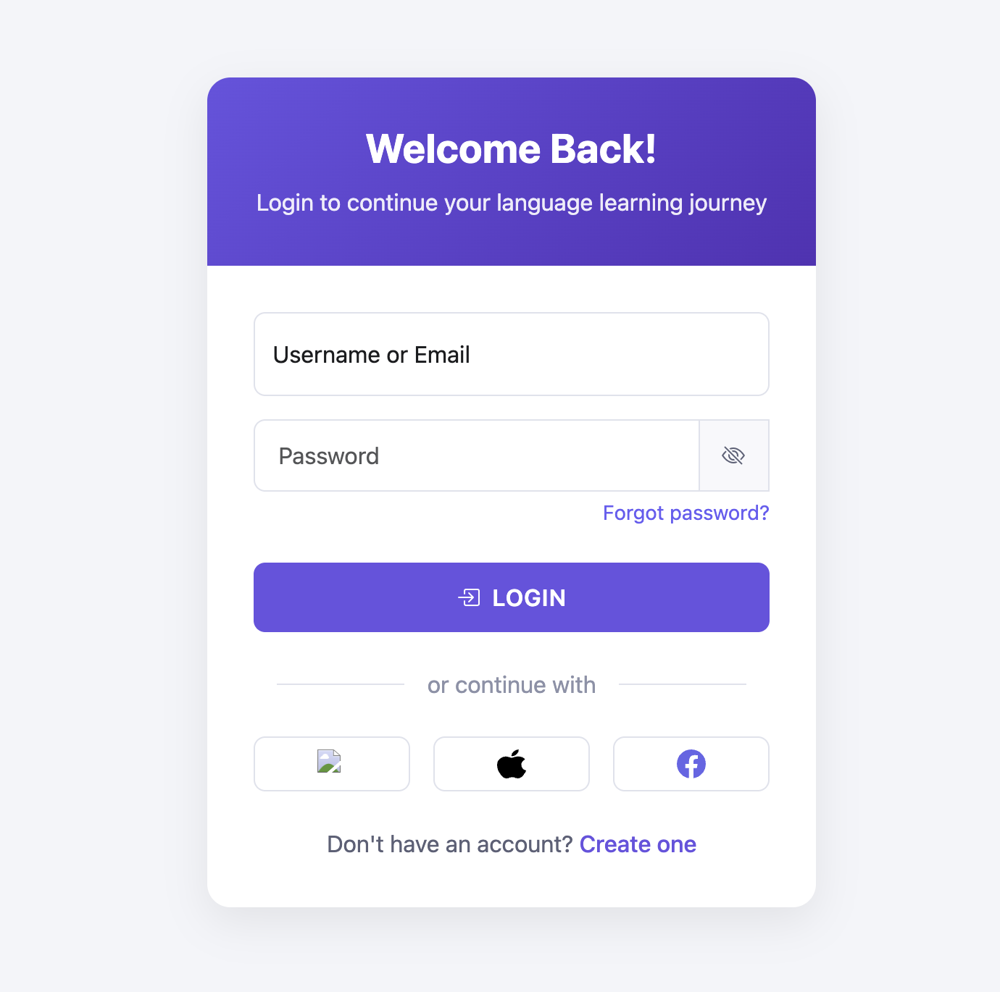
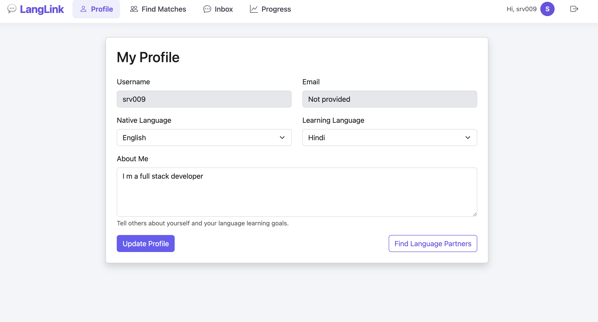
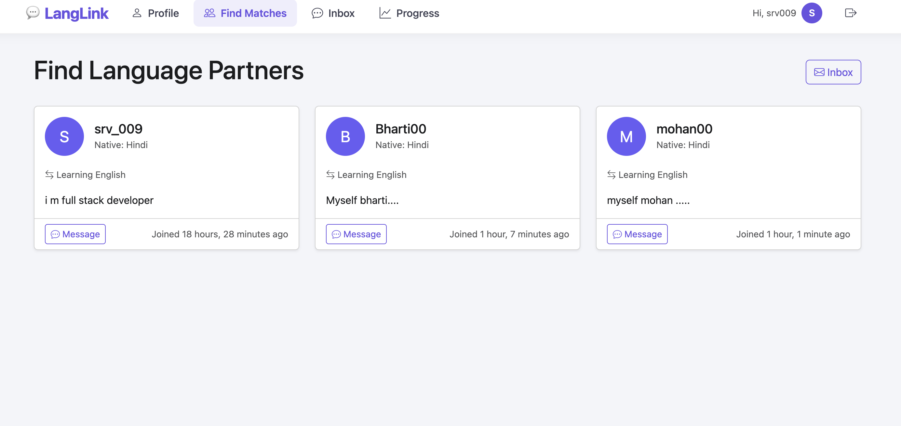
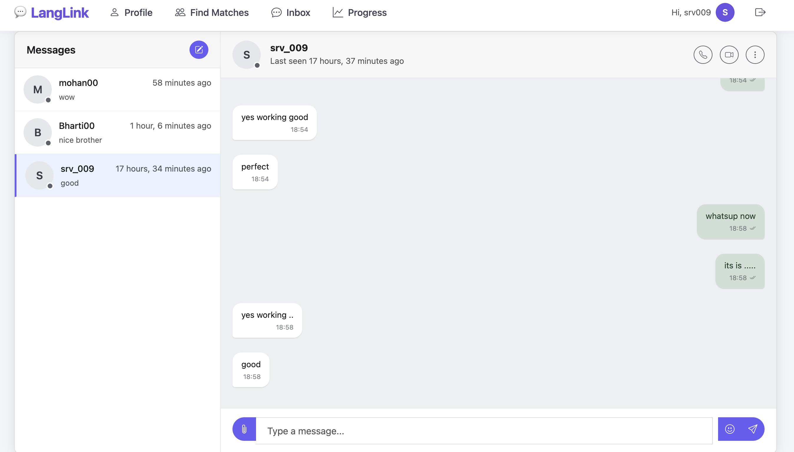
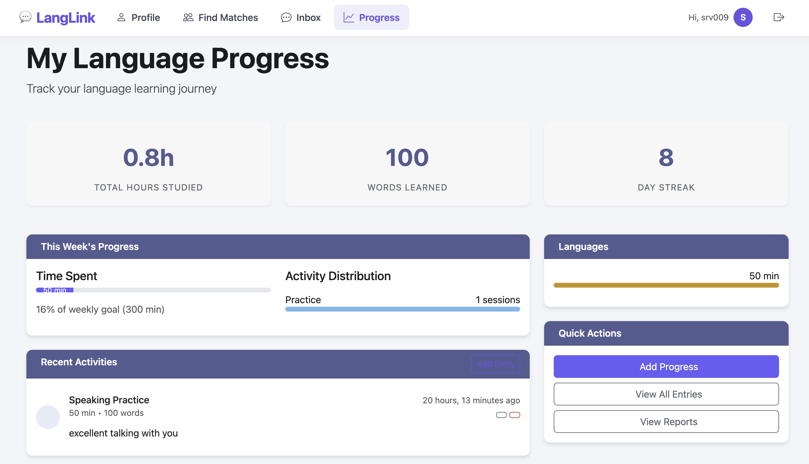

# LangLink - Language Exchange Platform

A language learning and exchange platform that connects language learners worldwide for mutual practice and cultural exchange.

## Features

- User authentication (Register, Login, Logout)
- User profiles with language preferences
- Match with language exchange partners
- Real-time chat functionality
- Progress tracking for language learning
- Responsive design for all devices

## Prerequisites

- Python 3.8+
- pip (Python package installer)
- SQLite (included with Python)

## Installation

1. **Clone the repository**
   ```bash
   git clone https://github.com/Srv108/LangLink.git
   cd LangLink
   ```

2. **Create and activate a virtual environment**
   ```bash
   # On macOS/Linux
   python3 -m venv venv
   source venv/bin/activate

   # On Windows
   python -m venv venv
   .\venv\Scripts\activate
   ```

3. **Install dependencies**
   ```bash
   pip install -r requirements.txt
   ```
   
   If you don't have a requirements.txt file, install the required packages manually:
   ```bash
   pip install django daphne channels channels-redis django-crispy-forms crispy-bootstrap5 pillow
   ```

4. **Apply migrations**
   ```bash
   python manage.py migrate
   ```

5. **Create a superuser (admin) account**
   ```bash
   python manage.py createsuperuser
   ```
   Follow the prompts to create an admin account.

6. **Run the development server**
   ```bash
   python manage.py runserver
   ```

7. **Access the application**
   - Open your browser and go to: http://127.0.0.1:8000/
   - Admin interface: http://127.0.0.1:8000/admin/

## Project Structure

```
LangLink/
├── language_exchange/     # Project configuration
├── main/                  # Main application
│   ├── migrations/        # Database migrations
│   ├── templates/         # HTML templates
│   ├── __init__.py
│   ├── admin.py          # Admin configuration
│   ├── apps.py           # App configuration
│   ├── models.py         # Database models
│   ├── urls.py           # URL routing
│   └── views.py          # View functions
├── static/               # Static files (CSS, JS, images)
├── templates/            # Base templates
├── .gitignore
├── manage.py            # Django management script
└── README.md            # This file
```

## Screenshots

### Home Page
() ()

### Registration Page
()

### Login Page
()

### User Profile
()

### Find Matches
()

### Inbox
()

### Progress Dashboard
()

## Configuration

### Environment Variables

Create a `.env` file in the project root with the following variables:

```
DEBUG=True
SECRET_KEY=your-secret-key-here
```

### Database

By default, the application uses SQLite. To use a different database, update the `DATABASES` setting in `language_exchange/settings.py`.

## Deployment

For production deployment, consider using:
- Web server: Nginx
- Application server: Gunicorn or uWSGI
- Database: PostgreSQL
- Cache: Redis
- WebSocket: Daphne with Redis channel layer

## Contributing

1. Fork the repository
2. Create a feature branch (`git checkout -b feature/AmazingFeature`)
3. Commit your changes (`git commit -m 'Add some AmazingFeature'`)
4. Push to the branch (`git push origin feature/AmazingFeature`)
5. Open a Pull Request

## License

This project is licensed under the MIT License - see the [LICENSE](LICENSE) file for details.

## Acknowledgments

- [Django](https://www.djangoproject.com/)
- [Bootstrap 5](https://getbootstrap.com/)
- [Django Channels](https://channels.readthedocs.io/)
- [Django Crispy Forms](https://django-crispy-forms.readthedocs.io/)

## Support

For support, email support@langlink.com or open an issue on GitHub.
